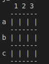
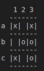
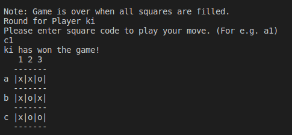
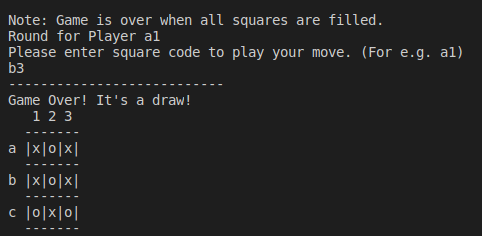

## Tic Tac Toe Game

A 3x3 grid game played by two users where each user takes turns in playing the one who gets 3 consecutive cells(boxes) **Wins!** 

## Game Description

The game board is as shown above, a 3x3 grid where each player take a turn and plays.

- The game starts by prompting both players for their names.
- We assume player one always starts, then player two
- Conventional symbols are ('x') for player one and ('o') for player two

##### There are four Winning possibilities for each player:

1) If a symbol ('x' or 'o') at any given point occupies an entire row (a1:a3, or b1:b3 or c1: c3) 
2) an entire column (a1:c1 or a2:c2 or a3:c3) 
3) if the symbol occupies the leading diagonal 
4)  if the symbol the antidiagonal.

 The first player to fulfill any of the above conditions is declared **Winner!**

 

##### Draw

There is a draw (or tie) if all cells are occupied without any player meeting the above conditions

## Game Conditions
- A cell can either be empty or owned by a player
- A **valid move** is possible only when a cell is empty.
- An **input is valid** if it is either a1,a2,a3 or b1,b2,b3 or c1, c2, c3

## Project Description

We were tasked to develop the the tic tac toe game so as to appreciate the power  OOp in Ruby.

To develop this game, we had four Milestones