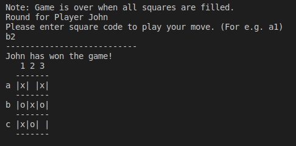

## Tic Tac Toe Game

A 3x3 grid game played by two users where each user takes turns in playing the one who gets 3 consecutive cells(boxes) **Wins!** 

## Game Description

**The grid board is as shown on this shot **

The game board is as shown above, a 3x3 grid where each player takes a turn and plays.

**Below is the grid with symbols**

- The game starts by prompting both players for their names.
- We assume player one always starts, then player two
- Conventional symbols are ('x') for player one and ('o') for player two

##### There are four Winning possibilities for each player:

1) If a symbol ('x' or 'o') at any given point occupies an entire row (a1:a3, or b1:b3 or c1: c3) 
2) an entire column (a1:c1 or a2:c2 or a3:c3) 
3) if the symbol occupies the leading diagonal 
4)  or if the symbol occupies the antidiagonal.

 The first player to fulfill any of the above conditions is declared **Winner!**
 
**See Winning Grid Below**

 

##### Draw

There is a draw (or tie) if all cells are occupied without any player meeting the above conditions.
**See draw Grid Below**

## Game Conditions
- A cell can either be empty or owned by a player
- A **valid move** is possible only when a cell is empty.
- An **input is valid** if it is either a1,a2,a3 or b1,b2,b3 or c1, c2, c3

## Project Description

To complete this project, it was separeted milestones:
**Milestone 1**
This was the setup milestone where we setup necceesary files for the project.
we called the the **setup-feature**

**Milestone 2**
For this milestone we designed our board, our 3x3 grid and inserted randomly the symbols. we called it the  **user_interface-feature

**Milestone 3**
This is where the actual implementation takes place, all considerations and assumptions for plays are done here:
-Creates game and player classes to hold or the methods
-We determine Who goes first
-We check for valid input and moves
-Game is played with each player taking turns
-We declare the winner if there is one otherwise its a tie

## Designed With
- Ruby
- Git

## Getting Started

To get a local copy of this repository up and running follow these simple steps:

### Prerequisites

- A PC or device with internet connection with the ability to use command line  or terminal.

### Setup

- Open the command line  or terminal

### Install

- Go to your preferred directory
- Run git clone git@github.com:krishnzzz/tic_tac_toe.git command

### Usage

- Open main file in your editor of choice

## Live Demo

[Live Demo Link](https://repl.it/github/krishnzzz/tic_tac_toe)

## Contributors

👤  **Suyash Fowdar**

- Github: [@Krishnzzz](https://github.com/krishnzzz)
- Twitter: [@Krishnzzz](https://twitter.com/Krishnzzz)
- LinkedIn: [Suyash Fowdar](https://www.linkedin.com/in/suyash-fowdar-22b89514a/)

👤 **Arrey Tabe**

- Github: [ArreyTabe](https://github.com/ArreyTabe)
- Twitter: [@tabe_arrey](https://twitter.com/tabe_arrey)
- LinkedIn: [Arrey Affuembey](https://www.linkedin.com/in/arrey-affuembey-80a8b11a8/)

## Show your support

Give a ⭐️ if you like this project!

## 📝 License

This project is [MIT](https://choosealicense.com/licenses/mit/) licensed.

